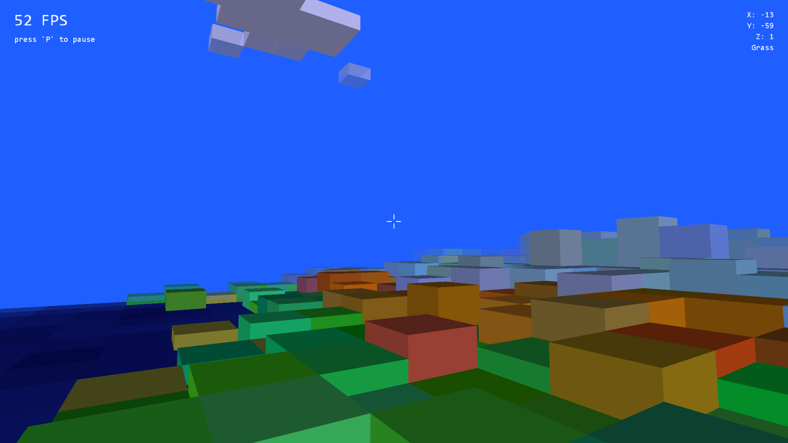

# Unbounded
A randomly generated 3D world implemented in Java using Processing

Current build screenshot:

## Features

* seemingly endless, *randomly generated world*
* water, sand, grass, hill, and mountain: *five different biomes*
* neat *animated water and clouds*
* lots of freedom: *walking, looking, and jumping around*
* players enabled to *manipulate the height of chunks*
* controls and map on *pause screen*
* possibility to *save maps and screenshots*

## Please note:
OpenGL libraries for Windows x64 are already part of the repository.
For all other OS: Please find your respective libraries [here](https://github.com/processing/processing/tree/master/core/library).
Also, you should edit the `.classpath` file and/or add the libraries to your build path.
